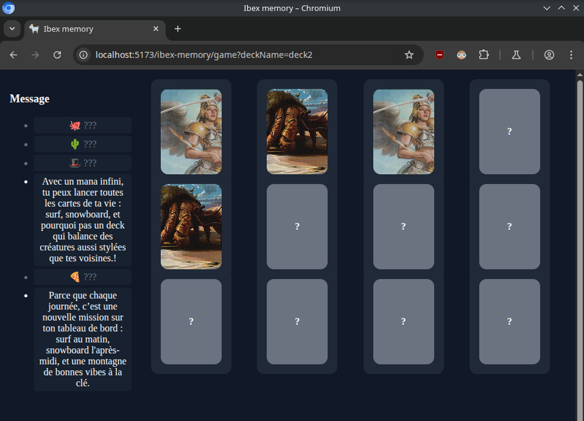

# ibex-memory

Jeu de Mémory pour l'anniversaire de l'année.
Après avoir sélectionné son deck, le joueur peut jouer au mémory et débloquer les messages associés à chacune des cartes.

## Démo

Une démo est disponible au lient suivant :

> [naedri.github.io/ibex-memory/](https://naedri.github.io/ibex-memory/)

<p>

</p>

## Installation & développement

```bash
git clone https://github.com/Naedri/ibex-memory
cd ibex-memory
npm install
npm run dev
```

## Build & déploiement

```bash
npm run build
```

Déploiement automatique sur GitHub Pages via GitHub Actions (branche `main`).

## Technologies principales

Ce projet utilise les bibliothèques suivantes :

- **Vue 3** : Framework principal
- **Vue Router** : Navigation
- **Pinia** : Gestion d’état
- **Vue I18n** : Internationalisation
- **UnoCSS** : Utilitaires CSS

## Personnalisation

### Play now

La page d'accueil ne proposera de jouer qu'en temps voulu.
Pour forcer l'affichage des decks disponibles le paramètre url `timeUp` peut être utilisé tel que :

- [naedri.github.io/ibex-memory/?timeUp=true](https://naedri.github.io/ibex-memory/?timeUp=true)

### Decks

D'autres decks peuvent être ajoutées dans le dossier [`./src/assets/decks/`](./src/assets/decks/) en tant que tableau de type `DeckCardFile[]`.
`DeckCardFile`est décrit dans [`./src/types/deck.ts`](./src/types/deck.ts).
L'attribut `imageUrl`de chaque cartes doit être unique.
